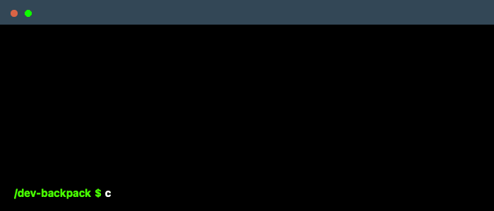

Hello and Welcome to the **CLLM** documentation!

CLLM is a **C**ommand **L**ine **L**arge Language **M**odel tool that is designed to help you write cli-command.
Currently, CLLM is based on **GPT-3.5 Turbo** Model, which is a large language model developed by OpenAI.

Below are the list of commands that you can use to interact with CLLM.
- `help` - To get the list of commands that you can use.
- `search` - To search for a specific command about your query.
- `set key` - To set the OpenAI API key for using CLLM.

If you have any questions or need help, feel free to ask in the [CLLM Discord](https://discord.gg/sy9BhhdbJu).

