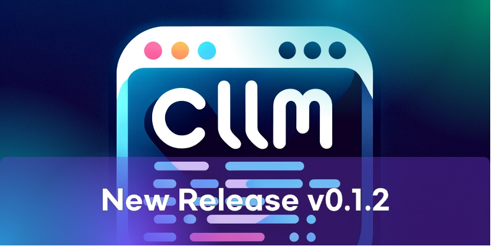

Today, we are excited to announce the release of CLLM 0.1.2!

### Highlights

This release includes the following updates:

- Added the new `cllm history` command to show the history of commands searched.
- Added the new `cllm describe` command to show the description of a command.
- Added CLLM icon to documentation.

### Other Changes
- [#29](https://github.com/dev-backpack/cllm/pull/29): Add installation script for macOS and Linux.
- [#34](https://github.com/dev-backpack/cllm/pull/34): Add error handling for CLI errors
- [#38](https://github.com/dev-backpack/cllm/pull/38): Add CLLM ASCII art logo to cllm

For more details, please refer to the [release notes](https://github.com/dev-backpack/cllm/releases/tag/v0.1.2).

### Contact Us

If you have any questions or need help, feel free to ask in the [CLLM Discord](https://discord.gg/sy9BhhdbJu).